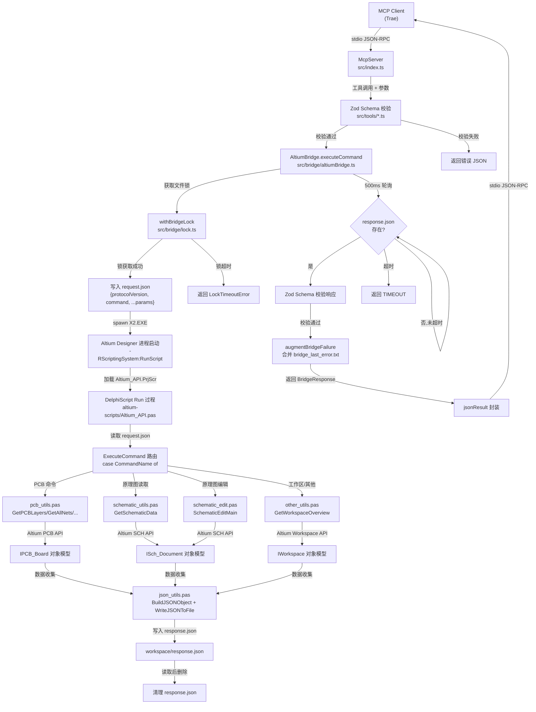

# 阶段一：全局架构与核心设计思路

## 1. 核心功能与根本问题

**一句话概括**：altium-mcp 是一个基于 Model Context Protocol (MCP) 的桥接服务器，通过 JSON 文件通信机制将 AI 助手（Trae 等）与 Altium Designer 连接。当前处于 **AI 顾问模式（Advisory Mode）**，仅提供读取、分析、审查能力，所有写入操作通过 Feature Flag 默认禁用，解决"AI 无法直接驱动专业 EDA 工具"的根本问题。

## 2. 架构模式与选择原因

### 采用的架构模式：分层 + 桥接代理 (Layered + Bridge Agent)

项目采用**分层架构**结合**文件桥接代理模式**，而非传统的微服务或事件驱动架构。选择该模式的原因：

| 因素 | 说明 |
|------|------|
| **Altium 约束** | Altium Designer 仅支持通过 DelphiScript 脚本自动化，无 HTTP/RPC 接口，必须使用文件作为进程间通信媒介 |
| **进程隔离** | MCP 服务器运行在 Node.js 进程中，Altium 运行在独立 GUI 进程中，文件桥接天然实现解耦 |
| **简单性** | 文件读写比 socket/管道更简单，无需处理连接管理、序列化协议栈 |
| **MCP 标准兼容** | MCP 协议基于 stdio，服务器作为 MCP 客户端与 Altium 之间的翻译层，职责清晰 |

### 架构选择的核心权衡

传统做法会考虑 socket 或 named pipe 实现进程间通信，但 Altium 的 DelphiScript 环境对网络 API 支持有限，且调试困难。JSON 文件方案虽然牺牲了性能（轮询 500ms），但换来了**零依赖、易调试、崩溃隔离**三大优势——任何一方崩溃都不会影响另一方，且可通过直接查看 `request.json`/`response.json` 排查问题。

## 3. 分层结构与职责边界

项目分为四层，每层有明确的职责与边界：

### 3.1 接口层 (MCP Interface Layer)

**文件**：`src/index.ts`、`src/toolDefinitions.ts`、`src/mcpInstructions.ts`

| 职责 | 边界 |
|------|------|
| 注册 MCP 工具并定义输入 Schema | 不包含业务逻辑，仅做参数校验和转发 |
| 向 MCP 客户端发送 `instructions` 指引 | 不直接操作文件系统（除 `get_server_status` 诊断） |
| 将工具调用参数转换为 bridge command | 不关心 Altium 如何执行命令 |

**关键类/函数**：
- `McpServer` 实例：注册 22 个活动工具（只读 + 库 + 输出 + 实用），通过 `StdioServerTransport` 与客户端通信
- `registerLiveCommand()`：工厂函数，统一注册只读 PCB 查询工具
- `jsonResult()` / `errResult()`：统一 MCP 响应格式封装
- Feature Flag 常量：`ENABLE_SCHEMATIC_WRITES`、`ENABLE_PCB_WRITES`、`ENABLE_SYMBOL_CREATION`（均默认 `false`），控制 7 个写入工具的注册与执行

### 3.2 桥接层 (Bridge Layer)

**文件**：`src/bridge/altiumBridge.ts`、`src/bridge/lock.ts`、`src/workspaceLayout.ts`、`src/altiumPaths.ts`、`src/altiumBundleFingerprint.ts`

| 职责 | 边界 |
|------|------|
| 写入 `request.json`，启动 Altium 进程执行脚本 | 不解析 bridge 响应的业务语义 |
| 轮询读取 `response.json` 并做 Schema 校验 | 不直接调用 Altium API |
| 文件锁序列化并发调用 | 不管理 Altium 生命周期（仅启动，不关闭） |
| 脚本包同步与指纹管理 | 不修改脚本内容 |

**关键类/函数**：
- `AltiumBridge` 类：核心桥接器，`executeCommand()` 是唯一入口
- `withBridgeLock()`：基于文件锁的互斥控制，支持 stale lock 检测
- `ensureAltiumScriptBundle()`：基于 SHA256 指纹的增量同步
- `launchAltiumRunScript()`：通过 `-RScriptingSystem:RunScript` 参数启动 Altium

### 3.3 工具/校验层 (Tools & Validation Layer)

**文件**：`src/tools/editSchematic.ts`、`src/tools/getSchematicData.ts`、`src/tools/designators.ts`、`src/tools/helpers.ts`

| 职责 | 边界 |
|------|------|
| 使用 Zod 定义工具输入 Schema 并校验 | 不执行 bridge 命令（交由接口层） |
| 对 bridge 返回数据做后处理（如提取 designators） | 不直接与 Altium 交互 |
| 参数语义校验（如 `parameter_names` 和 `parameter_values` 长度一致） | 不处理 Altium 侧的业务逻辑 |

**关键类/函数**：
- `editSchematicInputSchema`：使用 `superRefine` 实现 11 种 action 的差异化校验
- `getSchematicDataInputSchema`：定义 `include_queries` 枚举（15 种过滤桶）
- `parseDesignatorsFromComponentData()`：从组件数据中提取位号列表

### 3.4 执行层 (DelphiScript Execution Layer)

**文件**：`altium-scripts/Altium_API.pas`、`schematic_utils.pas`、`schematic_edit.pas`、`pcb_utils.pas`、`other_utils.pas`、`json_utils.pas`、`pcb_layout_duplicator.pas`

| 职责 | 边界 |
|------|------|
| 读取 `request.json`，解析命令和参数 | 不与 MCP 协议交互 |
| 调用 Altium API 执行 PCB/原理图操作 | 不写 `request.json`（只读） |
| 序列化结果为 JSON 并写入 `response.json` | 不管理文件锁（由 Node 侧控制） |
| 错误日志写入 `bridge_last_error.txt` | 不处理超时（由 Node 侧轮询控制） |

**关键类/函数**：
- `Run` 过程（`Altium_API.pas`）：DelphiScript 唯一入口，读取请求并分发命令
- `ExecuteCommand()`：命令路由器，通过 `case` 分发到 20+ 个命令处理器，写入命令受 Feature Flag 常量门控
- `WriteResponse()`：统一响应封装，自动检测 `ERROR:` 前缀并设置 `success` 字段
- `GetSchematicData()`：原理图数据采集，支持 legacy 和 filtered 两种模式
- `SchematicEditMain()`：原理图编辑入口，分发 11 种 action（当前通过 `ENABLE_SCHEMATIC_WRITES` 禁用）

## 4. 关键设计模式

### 4.1 命令模式 (Command Pattern)

**应用场景**：MCP 工具调用与 DelphiScript 命令的映射。

每个 MCP 工具对应一个 bridge command 字符串（如 `get_pcb_layers`、`schematic_edit`），`AltiumBridge.executeCommand()` 将命令和参数写入 `request.json`，DelphiScript 侧的 `ExecuteCommand()` 通过 `case` 语句路由到具体处理器。命令对象（request.json）封装了执行所需的所有信息，调用者无需知道接收方如何处理。

### 4.2 策略模式 (Strategy Pattern)

**应用场景**：`edit_schematic` 工具的多 action 分发。

`editSchematicInputSchema` 通过 `editSchematicActionEnum` 定义 11 种策略（`set_component_transform`、`place_component`、`add_wire` 等），每种策略有不同的参数要求和校验规则。`SchematicEditMain` 根据 `action` 字段选择对应的执行策略，新增 action 只需添加枚举值和对应分支，不修改现有逻辑。

### 4.3 代理模式 (Proxy Pattern)

**应用场景**：`AltiumBridge` 作为 Altium Designer 的代理。

Node 侧无法直接调用 Altium API，`AltiumBridge` 通过文件通信代理所有对 Altium 的操作。调用方（MCP 工具）像调用本地方法一样调用 `bridge.executeCommand()`，代理内部处理了进程启动、文件读写、锁管理、超时控制等横切关注点。

### 4.4 模板方法模式 (Template Method)

**应用场景**：DelphiScript 中所有数据获取函数遵循统一的执行模板。

`GetAllNets`、`GetPCBLayers`、`GetPCBRules` 等函数都遵循相同的流程：获取 Board → 创建迭代器 → 遍历对象收集属性 → `BuildJSONObject` → `WriteJSONToFile` → 返回 JSON 字符串。虽然 DelphiScript 不支持继承，但通过约定一致的代码结构实现了模板方法的效果。

### 4.5 工厂模式 (Factory Pattern)

**应用场景**：`registerLiveCommand()` 函数和 DelphiScript 的 `SchObjectFactory`。

Node 侧用 `registerLiveCommand()` 工厂函数批量注册结构相似的只读 PCB 工具，避免重复代码。DelphiScript 侧用 `SchObjectFactory(eSchComponent)` 等调用按枚举类型创建原理图对象，统一了对象的创建接口。

## 5. 核心数据流转路径



### 数据形态变化

| 节点 | 数据形态 |
|------|----------|
| MCP Client → Server | JSON-RPC over stdio，含工具名和参数对象 |
| Schema 校验 | Zod 解析后的类型安全对象 |
| request.json | `{ "protocolVersion": 1, "command": "xxx", ...params }` |
| DelphiScript 内部 | `TStringList` 逐行解析的键值对 |
| Altium API 返回 | IPCB_Board / ISch_Document 等 COM 对象 |
| response.json | `{ "success": boolean, "result"?: any, "error"?: string }` |
| MCP Server → Client | `{ "content": [{ "type": "text", "text": "JSON string" }] }` |

### 关键设计点

**文件锁序列化**：`.bridge.lock` 文件确保同一时刻只有一个 DelphiScript 实例在运行，避免 Altium 多实例冲突。锁文件写入 PID，`removeStaleBridgeLock()` 通过 `process.kill(pid, 0)` 检测进程是否存活，自动清理崩溃残留的锁。

**指纹同步机制**：`altiumBundleFingerprint.ts` 计算整个 `altium-scripts/` 目录的 SHA256 指纹，只有内容变化时才同步到 workspace，避免每次启动都复制文件。同步采用镜像策略（增删改），而非删除重建，保持 Altium 对脚本项目路径的稳定引用。

**错误增强**：`augmentBridgeFailure()` 在 bridge 返回失败时，读取 Altium 写入的 `bridge_last_error.txt` 并合并到错误信息中，使 AI 能看到 DelphiScript 侧的详细错误。对于编译期错误（Altium 不发送给 bridge），设计了 `bridge_user_reported_error.txt` 机制，用户手动粘贴 Altium Messages 面板内容后由 `get_server_status` 读取。

### 5. Feature Flag 门控架构

#### 设计动机

在项目开发过程中发现，通过 MCP 桥接对 Altium 原理图进行写入操作（放置元件、连线等）存在坐标变换、元件拉伸等不可控问题。为保证 AI 顾问模式的稳定性，采用 Feature Flag 机制将所有写入操作从工具列表中隐藏，改为纯读取 + 分析 + 建议的 Advisory Mode。

#### Feature Flag 定义

| 常量 | 默认值 | 控制的工具 | 定义位置 |
|------|--------|-----------|---------|
| `ENABLE_SCHEMATIC_WRITES` | `false` | `edit_schematic`（11 种 action） | `src/index.ts` + `Altium_API.pas` |
| `ENABLE_PCB_WRITES` | `false` | `set_component_position`, `move_components`, `create_net_class`, `set_pcb_layer_visibility`, `layout_duplicator_apply` | `src/index.ts` + `Altium_API.pas` |
| `ENABLE_SYMBOL_CREATION` | `false` | `create_schematic_symbol` | `src/index.ts` + `Altium_API.pas` |

#### 三层门控机制

```
调用链路: MCP Client → src/index.ts → Altium_API.pas

Layer 1: 工具注册门控 (src/index.ts)
├─ if (ENABLE_SCHEMATIC_WRITES) { server.registerTool("edit_schematic", ...) }
├─ if (ENABLE_PCB_WRITES) { server.registerTool("set_component_position", ...) }
└─ if (ENABLE_SYMBOL_CREATION) { server.registerTool("create_schematic_symbol", ...) }
→ 关闭时工具不出现在 MCP tools/list 中，客户端无法发现

Layer 2: 执行命令门控 (Altium_API.pas ExecuteCommand)
├─ if (not ENABLE_SCHEMATIC_WRITES) and (Command='schematic_edit') → 返回 WRITE_OPERATIONS_DISABLED
├─ if (not ENABLE_PCB_WRITES) and (Command in [...]) → 返回 WRITE_OPERATIONS_DISABLED
└─ if (not ENABLE_SYMBOL_CREATION) and (Command='create_schematic_symbol') → 返回 WRITE_OPERATIONS_DISABLED
→ 即使绕过 Layer 1，DelphiScript 侧也会拦截

Layer 3: 操作级门控 (SchematicEditMain 等)
└─ 写入操作内部的具体函数调用同样检查 Feature Flag 常量
→ 防止未来重构时遗漏
```

#### 工具分类（当前状态）

| 分类 | 工具数 | 状态 | 工具列表 |
|------|--------|------|----------|
| 环境诊断 | 3 | ✅ 启用 | get_server_status, configure_altium_exe, altium_ping |
| 工作区 | 1 | ✅ 启用 | get_workspace_projects |
| PCB 只读 | 7 | ✅ 启用 | get_pcb_layers, get_pcb_rules, get_all_nets, get_pcb_layer_stackup, get_all_designators, get_component_pins, get_selected_components |
| 原理图读取 | 1 | ✅ 启用 | get_schematic_data |
| 库与记忆 | 5 | ✅ 启用 | get_library_symbol_reference, search_library_symbol, import_library_components, get_memory_status, refresh_memory_cache |
| 布局发现 | 1 | ✅ 启用 | layout_duplicator |
| 输出作业 | 2 | ✅ 启用 | get_output_job_containers, run_output_jobs |
| 截图与本地 | 2 | ✅ 启用 | take_view_screenshot, file_mode_capabilities |
| **原理图写入** | **1** | **❌ 禁用** | **edit_schematic** (11 actions) |
| **PCB 写入** | **5** | **❌ 禁用** | **set_component_position, move_components, create_net_class, set_pcb_layer_visibility, layout_duplicator_apply** |
| **符号创建** | **1** | **❌ 禁用** | **create_schematic_symbol** |

#### 恢复写入操作

需要恢复某类写入操作时，需同步修改两处：
1. `src/index.ts`：将对应常量改为 `true`
2. `altium-scripts/Altium_API.pas`：将对应常量改为 `True`
3. 重新编译 TypeScript（`npx tsc`）+ 在 Altium 中重新编译脚本项目

---

**阶段一完成。** 以上分析基于 `src/` 目录下全部 TypeScript 源码、`altium-scripts/` 下全部 DelphiScript 源码、`schemas/` 下的 JSON Schema 以及 `package.json` 配置文件的真实代码内容。

请确认或补充信息，确认后我将进行阶段二（模块依赖与文件调用关系）的分析。
