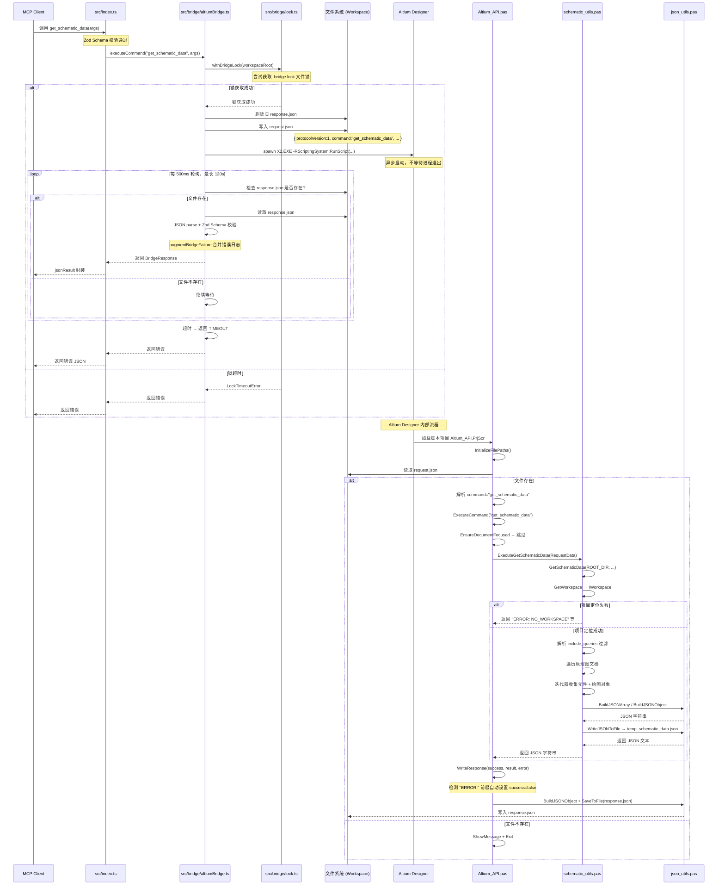
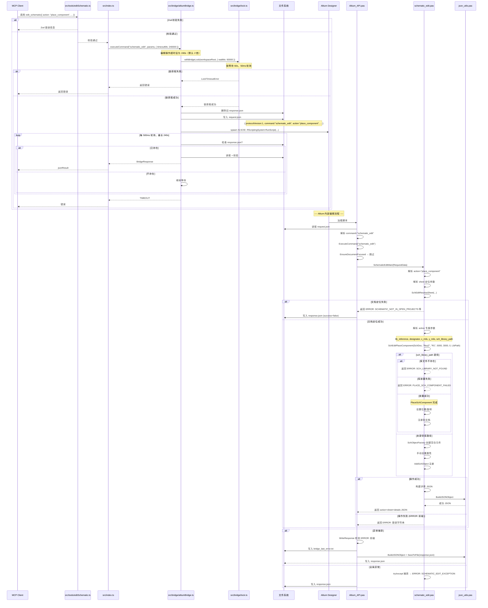

# 阶段三：核心业务流程与工作原理

## 1. 核心业务流程选择

选取项目中两个最核心的流程进行分析：

| 流程 | 类型 | 选择原因 |
|------|------|----------|
| **原理图数据读取 (`get_schematic_data`)** | 只读查询 | 最常用的工具，展示了完整的请求-响应数据通路，包含复杂的过滤机制和 15 种对象类型的分桶序列化 |
| **PCB 只读查询 (`get_pcb_layers` + `get_component_pins`)** | 只读查询 | 典型的 PCB 聚焦查询流程，展示了文档聚焦、数据后处理（提取位号列表）、多层信息交叉验证的完整链路，是 AI 顾问模式下最常用的操作组合 |

> **已禁用流程**：原理图编辑 (`edit_schematic`) 和 PCB 写入操作当前通过 Feature Flag 机制禁用（详见阶段一第 6 节）。代码实现完整保留，启用 Feature Flag 后即可恢复。本文档第 3 节仍保留其实现分析供参考。

## 2. 流程一：原理图数据读取 (`get_schematic_data`)

### 2.1 完整调用链

```
MCP Client (Trae)
  │
  │  [1] 调用 get_schematic_data 工具
  │      JSON-RPC: { method: "tools/call", params: { name: "get_schematic_data",
  │        arguments: { schematic_full_path?, project_full_path?, include_queries? } } }
  │
  ▼
src/index.ts - get_schematic_data 处理器
  │
  │  [2] 接收参数，直接透传给 bridge.executeCommand("get_schematic_data", params)
  │      说明：本层不处理 get_schematic_data 的业务逻辑，仅做类型转发
  │
  ▼
src/bridge/altiumBridge.ts - AltiumBridge.executeCommand()
  │
  │  [3] ensureLayout()：检查工作区目录和脚本包同步
  │      - 读取 workspace/AltiumScript/.mcp-bundle.sha256
  │      - 与 altium-scripts/ 的指纹比对，不一致则镜像同步
  │
  │  [4] resolveAltiumExePath()：解析 X2.EXE 路径
  │      - 优先级：config.json → env ALTIUM_MCP_ALTIUM_EXE → 自动发现
  │
  │  [5] 获取脚本项目路径 scriptProjectPath()
  │      - 路径: workspace/AltiumScript/Altium_API.PrjScr
  │
  │  [6] 删除旧 response.json (如果存在)
  │
  │  [7] 写入 request.json
  │      {
  │        "protocolVersion": 1,
  │        "command": "get_schematic_data",
  │        "schematic_full_path": "...",
  │        "include_queries": ["components", "wires", "net_labels"]
  │      }
  │
  │  [8] 启动 Altium 进程
  │      spawn("X2.EXE -RScriptingSystem:RunScript(ProjectName="...Altium_API.PrjScr"|ProcName="Altium_API>Run")")
  │
  │  [9] 500ms 循环轮询 response.json，直到超时 (120s) 或文件出现
  │
  ▼
altium-scripts/Altium_API.pas - Run 过程
  │
  │  [10] InitializeFilePaths()：计算 ROOT_DIR、REQUEST_FILE、RESPONSE_FILE
  │
  │  [11] 读取 request.json 到 TStringList（逐行文本）
  │
  │  [12] 解析命令: 遍历行，找到 "command": 提取值 → "get_schematic_data"
  │       ExtractParameter()：逐行解析其他参数键值对
  │
  │  [13] ExecuteCommand("get_schematic_data")
  │       - EnsureDocumentFocused("get_schematic_data") → 跳过聚焦（schematic 和 edit 不需要聚焦）
  │       - case 'get_schematic_data' of → ExecuteGetSchematicData(RequestData)
  │
  ▼
altium-scripts/schematic_utils.pas - GetSchematicData()
  │
  │  [14] 获取工作区: GetWorkspace → IWorkspace
  │
  │  [15] 三分支定位项目：
  │       ├─ SchematicFullPath 非空 → 遍历所有项目文档匹配 DM_FullPath
  │       ├─ ProjectFullPath 非空 → 按路径匹配项目
  │       └─ 两者都空 → 取 WS.DM_FocusedProject
  │
  │  [16] 解析 include_queries:
  │       └─ SchDataParseStringArray → SchMcpResolveIncludes
  │           ├─ 空 token → LegacyCombined = true (legacy 模式)
  │           ├─ "all" → SchMcpSetAllIncludes (15 种全部)
  │           └─ 逐个匹配 token → 填充 IncFlags
  │
  │  [17] 遍历项目的所有原理图文档 (DM_DocumentKind='SCH')
  │       └─ 对每个匹配的 .SchDoc:
  │
  │            ┌─ [18] 元件收集 (如果 LegacyCombined 或 flags 含 'components')
  │            │    └─ 迭代器 MkSet(eSchComponent)
  │            │       └─ 每个元件: 提取 designator, x/y/width/height/rotation(mils)
  │            │       └─ 内层迭代器 MkSet(eParameter): Name/Text → parameters 对象
  │            │
  │            └─ [19] 绘图对象收集
  │                 ├─ LegacyCombined: SchCollectDrawingObjectsForSheet (一次性全集)
  │                 └─ 分类模式: 按 flags 分别调用 SchAppendFilteredDrawings
  │                     ├─ wires → eWire 迭代器
  │                     ├─ buses → eBus + eBusEntry 迭代器
  │                     ├─ net_labels → eNetLabel 迭代器
  │                     ├─ power_ports → ePowerObject 迭代器
  │                     ├─ text_labels → eLabel 迭代器
  │                     ├─ junctions → eJunction 迭代器
  │                     ├─ ports → ePort 迭代器
  │                     ├─ off_sheet_connectors → eCrossSheetConnector 迭代器
  │                     ├─ sheet_symbols → eSheetSymbol 迭代器
  │                     ├─ directives → eNoERC + eCompileMask 迭代器
  │                     ├─ figures → 11 种图形对象迭代器
  │                     └─ sheet → SchBuildSheetInfoObject (文档属性)
  │
  │  [20] 构建 JSON 输出
  │       ├─ Legacy: { "components": [...], "drawing_objects": [...] }
  │       └─ Filtered: { "schematic_data_mode": "filtered",
  │            "include_queries": [...], "sheets": [...], "components": [...],
  │            "wires": [...], "buses": [...], ... }
  │
  │  [21] WriteJSONToFile(OutputLines, ROOT_DIR + 'temp_schematic_data.json')
  │       └─ SaveToFile → LoadFromFile 读回完整文本 → 返回字符串
  │
  ▼
Altium_API.pas - WriteResponse
  │
  │  [22] 检查返回字符串是否以 'ERROR:' 开头
  │       ├─ 是 → 设置 success=false, error=ERROR: 后面的内容
  │       └─ 否 → 设置 success=true, result=返回字符串
  │
  │  [23] BuildJSONObject → SaveToFile(RESPONSE_FILE)
  │
  ▼
src/bridge/altiumBridge.ts - 轮询循环
  │
  │  [24] 检测到 response.json 存在
  │  [25] 读取文件内容, JSON.parse
  │  [26] BridgeResponseSchema.safeParse() 校验响应格式
  │       ├─ 校验通过 → 如果是 success=false, 调用 augmentBridgeFailure()
  │       └─ 校验失败 → 返回 INVALID_BRIDGE_RESPONSE
  │
  ▼
src/index.ts - get_schematic_data 处理器
  │
  │  [27] 收到 BridgeResponse → jsonResult() 封装
  │
  ▼
MCP Client
  │
  │  [28] 收到 JSON-RPC 响应: { content: [{ type: "text", text: "{...}" }] }
```

### 2.2 各节点职责与关键逻辑

| 节点 | 文件 | 职责 | 关键逻辑 | 异常处理 | 边界条件 |
|------|------|------|----------|----------|----------|
| [1] | MCP Client | 发起工具调用 | 用户/AI 构造参数 | 超时客户端断开 | 参数缺失由 Zod Schema 拦截 |
| [2] | `src/index.ts` | 转发参数 | 传参到 `bridge.executeCommand()`，不处理业务 | 意外错误由 `jsonResult` 包装 | 参数已在 Zod 层校验通过 |
| [3] | `altiumBridge.ts` | 环境准备 | 指纹比对，增量同步 | 脚本目录不存在则抛出异常 | force 模式下强制同步 |
| [4] | `altiumBridge.ts` | 路径解析 | 三级优先级回退 | `undefined` 时返回 `AD_NOT_FOUND` | 路径含空格用引号包裹 |
| [5] | `altiumBridge.ts` | 路径拼接 | 固定拼接 `/AltiumScript/Altium_API.PrjScr` | 文件不存在返回 `SCRIPT_PROJECT_NOT_FOUND` | 确保路径分隔符正确 |
| [6-7] | `altiumBridge.ts` | 写入请求 | 删除旧响应，写入新请求 JSON | 删除失败忽略 | 大参数 JSON 需正确序列化 |
| [8] | `altiumBridge.ts` | 启动进程 | `spawn` 带 `shell:true` 和 `detached:true` | spawn 失败返回 `ALT_LAUNCH_FAILED` | Altium 可能已启动，此处是再次触发执行 |
| [9] | `altiumBridge.ts` | 轮询等待 | 500ms 间隔，120s 超时 | 超时返回 `TIMEOUT` | 锁可能占用，需等待锁释放 |
| [10] | `Altium_API.pas` | 路径初始化 | 从脚本项目路径反推工作区根目录 | 路径解析失败导致文件读写错 | 路径字符串以 `\` 结尾 |
| [11] | `Altium_API.pas` | 文件读取 | `TStringList.LoadFromFile` | 文件不存在则 `ShowMessage` 并退出 | 文件编码需为 UTF-8 |
| [12] | `Altium_API.pas` | 参数解析 | 逐行子串匹配，非完整 JSON 解析器 | 未找到 `command` 字段返回 `No command specified` | 不支持嵌套 JSON 对象 |
| [13] | `Altium_API.pas` | 命令路由 | `case` 语句分发 | 未知命令 `ShowMessage('Error: Unknown command')` | 参数通过全局变量传递 |
| [14] | `schematic_utils.pas` | 获取工作区 | `GetWorkspace` 全局函数 | nil 返回 `ERROR: NO_WORKSPACE` | 无打开项目时 |
| [15] | `schematic_utils.pas` | 项目定位 | 三分支匹配逻辑 | 各分支对应不同错误码 | 同时提供 `schematic_full_path` 和 `project_full_path` 时优先前者 |
| [16] | `schematic_utils.pas` | 过滤解析 | token 小写化后匹配，`all` 短路清空全选 | 所有 token 无效回退 legacy 模式 | 空数组时 `LegacyCombined=true` |
| [17] | `schematic_utils.pas` | 文档遍历 | 统计 `DM_DocumentKind='SCH'` 数量 | 无原理图文档返回空数组 | 大型项目可能有数十个原理图页 |
| [18] | `schematic_utils.pas` | 元件收集 | `ISch_Iterator` 遍历，参数嵌套迭代器 | 空迭代器返回空数组 | 元件参数可能包含多行文本 |
| [19] | `schematic_utils.pas` | 对象收集 | 按 FilterKind 分 11 种迭代器 | 未知 FilterKind 销毁迭代器并退出 | 大型图纸可能有数千个对象 |
| [20] | `schematic_utils.pas` | JSON 构建 | `BuildJSONObject/Array` 手动拼接 | 内存不足时 TStringList 异常 | 超大图纸 JSON 可能达到数 MB |
| [21] | `schematic_utils.pas` | 文件写入 | `SaveToFile` → `LoadFromFile` 两段式 | 文件写入失败返回 `{"error": ...}` | 临时文件未清理仅在 `FileName` 空时 |
| [22] | `Altium_API.pas` | 响应封装 | 检测 `ERROR:` 前缀自动设置 `success` | 错误时写入 `bridge_last_error.txt` | 非 `ERROR:` 开头的错误文本不会触发 `success=false` |
| [23] | `Altium_API.pas` | 响应写入 | `SaveToFile(RESPONSE_FILE)` | 写入失败 `ShowMessage` | 文件路径必须可写 |
| [24-26] | `altiumBridge.ts` | 响应读取 | 轮询检测文件存在，`JSON.parse` + Zod 校验 | 格式错误返回 `INVALID_BRIDGE_RESPONSE` | 响应可能被截断或损坏 |
| [27] | `src/index.ts` | 响应封装 | `jsonResult()` 统一格式 | 无额外处理 | 大数据量 JSON 可能超 MCP 消息大小限制 |

### 2.3 性能瓶颈、风险点与设计权衡

| 问题 | 类型 | 说明 | 影响 |
|------|------|------|------|
| **文件轮询延迟** | 性能瓶颈 | 每次 `get_schematic_data` 调用至少需要 500ms-2s（Altium 启动 + 脚本执行 + 文件写入） | 用户体验差，不适合频繁查询 |
| **超大图纸序列化** | 性能瓶颈 | 数千个对象的手动 `TStringList` 拼接可能导致内存压力 | 大图纸可能返回数 MB JSON，MCP 客户端可能截断 |
| **逐行 JSON 解析** | 潜在风险 | DelphiScript 使用子串匹配而非完整 JSON 解析器，不支持嵌套数组 | `include_queries` 数组解析依赖 JSON 格式化格式（每行一个元素），如果格式变化会解析失败 |
| **Legacy 回退陷阱** | 设计权衡 | 当 `include_queries` 参数写错（如 `"wire"` 而非 `"wires"`）时，静默回退到 legacy 模式，返回 `components + drawing_objects` 而非用户期望的分桶数据 | 用户可能误以为过滤生效，实际获得的是全集 |
| **`TStringList` 序列化可靠性** | 潜在风险 | `SaveToFile`/`LoadFromFile` 的 JSON 来回转换可能引入换行符不一致 | 极少数情况下 JSON 格式异常 |
| **`FloatToStr` 本地化问题** | 设计权衡 | 已用 `StringReplace(..., ',', '.', ...)` 处理，但各语言环境的数字格式差异可能仍是个问题 | 非英语 Windows 系统可能出现坐标值含逗号 |
| **无增量更新机制** | 设计权衡 | 每次查询都全量重新读取整个原理图，没有缓存机制 | 重复查询同一张图时浪费 Altium API 调用 |

## 3. 流程二：PCB 只读查询（`get_pcb_layers` + `get_component_pins`）

> 当前 AI 顾问模式下最常用的操作组合：聚焦 PCB → 读取层信息 → 获取所有位号 → 查询具体元件引脚。

### 3.1 完整调用链（`get_component_pins` 为例）

```
MCP Client (Trae)
  │
  │  [1] 用户在 Altium 中聚焦 .PcbDoc → 调用 get_pcb_layers 确认层结构
  │      JSON-RPC: { method: "tools/call", params: { name: "get_pcb_layers", arguments: {} } }
  │
  ▼
src/index.ts - get_pcb_layers 处理器
  │
  │  [2] registerLiveCommand 注册的透传工具
  │      bridge.executeCommand("get_pcb_layers", {})
  │
  ▼
src/bridge/altiumBridge.ts - AltiumBridge.executeCommand()
  │
  │  [3] withBridgeLock()：获取文件锁
  │  [4] ensureLayout()：脚本包同步
  │  [5] resolveAltiumExePath()：解析 X2.EXE 路径
  │  [6] 写入 request.json: { protocolVersion: 1, command: "get_pcb_layers" }
  │  [7] 启动 Altium 执行脚本
  │  [8] 轮询等待 response.json（120s 超时）
  │
  ▼
Altium_API.pas - ExecuteCommand("get_pcb_layers")
  │
  │  [9] EnsureDocumentFocused → 检查是否聚焦了 .PcbDoc
  │       ├─ 未聚焦 → 返回错误
  │       └─ 已聚焦 → 继续
  │  [10] case 'get_pcb_layers' → GetPCBLayers
  │
  ▼
pcb_utils.pas - GetPCBLayers()
  │
  │  [11] GetWorkspace → IWorkspace
  │  [12] 获取活动 PCB 文档
  │  [13] PCBServer.GetCurrentPCBBoard → IPCB_Board
  │  [14] 遍历 Board.LayerStack 收集层信息
  │       └─ 每层提取: name, layerId, layerKind, isSignal, copper thickness, dielectric constant
  │  [15] BuildJSONArray + WriteJSONToFile → response.json
  │
  ▼
AltiumBridge → 响应读取 → 返回层列表 JSON
  │
  │  [16] AI 分析层结构 → 选取一个位号 → 调用 get_component_pins
  │      arguments: { designators: ["U1"] }
  │
  ▼
src/index.ts - get_component_pins 处理器
  │
  │  [17] 内部先调用 get_all_component_data 获取全板数据
  │       bridge.executeCommand("get_all_component_data", {})
  │  [18] parseDesignatorsFromComponentData() 提取位号列表
  │       → 用户选择 U1 → 再次调用 get_all_component_data
  │  [19] 从全板数据中筛选 U1 的引脚信息
  │       → pinNumber, netName, padX, padY, layer
  │
  ▼
AltiumBridge → 返回引脚数组
  │
  │  [20] AI 分析引脚连接 → 生成接线建议或审查报告
```

### 3.2 各节点职责与关键逻辑

| 节点 | 文件 | 职责 | 关键逻辑 | 异常处理 |
|------|------|------|----------|----------|
| [1] | MCP Client | 发起工具调用 | 用户/AI 构造参数 | 聚焦 PCB 前置条件由 AI 检查 |
| [2] | `src/index.ts` | 透传转发 | `registerLiveCommand` 统一注册，不处理业务 | 意外错误由 `jsonResult` 包装 |
| [3-8] | `altiumBridge.ts` | 桥接通信 | 与 `get_schematic_data` 相同的桥接流程 | 锁超时、进程启动失败等 |
| [9] | `Altium_API.pas` | 文档聚焦检查 | `EnsureDocumentFocused("get_pcb_layers")` | PCB 未聚焦返回错误 |
| [10-14] | `pcb_utils.pas` | PCB 数据采集 | `IPCB_Board.LayerStack` 遍历 | 无 PCB 返回空数组 |
| [15] | `json_utils.pas` | JSON 构建 | `BuildJSONArray` + `SaveToFile` | 大层叠结构 JSON 可能较大 |
| [17-19] | `src/index.ts` | 数据后处理 | `parseDesignatorsFromComponentData()` 提取位号 | 位号不存在返回空 |

### 3.3 AI 顾问模式下的典型工作流

```
1. get_server_status    → 确认环境正常
2. get_pcb_layers       → 了解层结构
3. get_pcb_layer_stackup → 了解层叠参数
4. get_all_nets         → 获取网络列表
5. get_all_designators  → 获取元件清单
6. get_component_pins   → 查询关键元件引脚
7. get_schematic_data   → 交叉验证原理图设计
8. 综合分析 → 生成审查报告 / 选型建议 / 优化方案
```

---

## 4. 流程三：原理图编辑 (`edit_schematic`) — **已禁用**

> ⚠️ **当前状态**：`edit_schematic` 通过 `ENABLE_SCHEMATIC_WRITES = false` Feature Flag 禁用。
> 调用时返回 `WRITE_OPERATIONS_DISABLED` 错误。代码实现完整保留在 `schematic_edit.pas` 中。
>
> **启用方法**：将 `src/index.ts` 和 `altium-scripts/Altium_API.pas` 中的 `ENABLE_SCHEMATIC_WRITES` 改为 `true`，重新编译后即可恢复。

以下为该流程的实现分析（供启用后参考）：

### 4.1 完整调用链

以 `place_component` action 为例（最复杂的 action）：

```
MCP Client
  │
  │  [1] 调用 edit_schematic 工具
  │      JSON-RPC: { method: "tools/call", params: { name: "edit_schematic",
  │        arguments: {
  │          action: "place_component",
  │          schematic_full_path: "D:/Project/Sheet1.SchDoc",
  │          lib_reference: "Res2",
  │          designator: "R1",
  │          x_mils: 5000, y_mils: 3000,
  │          rotation_deg: 0,
  │          sch_library_path: "C:/Library/Miscellaneous Devices.SchLib"
  │        } } }
  │
  ▼
src/tools/editSchematic.ts - Zod Schema 校验
  │
  │  [2] action="place_component" → 进入 place_component 校验分支
  │      ├─ 校验 lib_reference 非空             ✓ "Res2" 通过
  │      ├─ 校验 designator 非空               ✓ "R1" 通过
  │      ├─ 校验 x_mils 和 y_mils 非 undefined   ✓ 通过
  │      └─ 校验 sheet 定位参数非空              ✓ schematic_full_path 提供
  │
  │  [3] 校验通过，进入处理器
  │
  ▼
src/index.ts - edit_schematic 处理器
  │
  │  [4] 调用 bridge.executeCommand("schematic_edit", params, { timeoutMs: 240_000 })
  │      注意：编辑操作超时 240s（默认 120s 的两倍），因为 Altium 图形界面
  │      操作可能较慢，且锁等待时间也计入超时
  │
  ▼
src/bridge/altiumBridge.ts - executeCommand()
  │
  │  [5] withBridgeLock()：获取文件锁 .bridge.lock（默认 60s 等待）
  │      ├─ 锁获取成功 → 继续
  │      └─ 锁超时 → LockTimeoutError
  │
  │  [6] ensureLayout() → 同步脚本
  │  [7] resolveAltiumExePath() → 获取 X2.EXE 路径
  │  [8] 删除旧 response.json，写入 request.json
  │  [9] launchAltiumRunScript() → 启动 Altium 执行脚本
  │  [10] 轮询等待 response.json（240s 超时，500ms 间隔）
  │
  ▼
Altium_API.pas - Run 过程
  │
  │  [11] 读取 request.json，解析 command="schematic_edit"
  │  [12] ExecuteCommand("schematic_edit") → SchematicEditMain(RequestData)
  │
  ▼
altium-scripts/schematic_edit.pas - SchematicEditMain()
  │
  │  [13] 解析 action="place_component"（归一化，无 alias 转换）
  │  [14] 解析 sheet 定位参数：
  │       ├─ "schematic_full_path" → "D:/Project/Sheet1.SchDoc"
  │       └─ "project_full_path" 未提供
  │
  │  [15] SchEditResolveSheet()：定位原理图文档
  │       └─ 遍历 workspace 项目，匹配 DM_FullPath
  │       └─ Client.OpenDocument('SCH', ...) → 打开文档
  │       └─ SchServer.GetSchDocumentByPath → ISch_Document
  │       └─ 失败返回 ERROR: SCHEMATIC_NOT_IN_OPEN_PROJECTS 等
  │
  │  [16] dispatcher: action = "place_component"
  │       └─ 解析 action 专属参数：
  │           ├─ SchEditParseStringAfterKey → "lib_reference" → "Res2"
  │           ├─ SchEditParseStringAfterKey → "designator" → "R1"
  │           ├─ SchEditParseStringAfterKey → "sch_library_path" → "C:/Library/..."
  │           ├─ SchEditParseFloatAfterKey → "x_mils" → 5000.0
  │           ├─ SchEditParseFloatAfterKey → "y_mils" → 3000.0
  │           └─ SchEditParseFloatAfterKey → "rotation_deg" → 0.0
  │
  │  [17] 调用 SchEditPlaceComponent(SchDoc, "Res2", "R1", 5000, 3000, 0, LibPath)
  │
  ▼
schematic_edit.pas - SchEditPlaceComponent()
  │
  │  [18] 检查 sch_library_path 是否提供
  │       ├─ 提供 → 分支 A: 库放置
  │       │   ├─ FileExists(LibPath) 检查 → 不存在返回 ERROR: SCH_LIBRARY_NOT_FOUND
  │       │   ├─ SchDoc.PlaceSchComponent(LibPath, LibRef) 放置
  │       │   │   └─ 返回放置后的元件对象
  │       │   └─ 放置失败返回 ERROR: PLACE_SCH_COMPONENT_FAILED
  │       │
  │       └─ 未提供 → 分支 B: 空白放置
  │           └─ SchObjectFactory(eSchComponent) 创建空白元件
  │               └─ 设置 LibReference, Designator, 位置, 旋转
  │               └─ 注册到文档容器
  │
  │  [19] 设置元件属性：
  │       ├─ SchComponent.LibReference := "Res2"
  │       ├─ SchComponent.Designator.Name := "R1"
  │       ├─ SchComponent.Location := Point(MilsToCoord(5000), MilsToCoord(3000))
  │       └─ SchComponent.Orientation := SchEditRotationFromDeg(0)
  │
  │  [20] 注册到原理图文档
  │       └─ SchDoc.AddSchObject(SchComponent)
  │       └─ SchServer.RobotManager.SendMessage(...) 通知 UI 更新
  │
  │  [21] 返回放置详情 JSON: { "designator": "R1", "lib_reference": "Res2",
  │         "x_mils": 5000, "y_mils": 3000, "rotation_deg": 0, "sch_library_path": "..." }
  │
  ▼
SchematicEditMain() - 响应包装
  │
  │  [22] 检查 Inner 是否以 "ERROR:" 开头
  │       └─ 否 → 构建成功响应
  │           { "action": "place_component", "sheet": "D:/.../Sheet1.SchDoc",
  │             "details": { "designator": "R1", ... } }
  │
  ▼
Altium_API.pas - WriteResponse → SaveToFile(RESPONSE_FILE)
  │
  ▼
src/bridge/altiumBridge.ts - 轮询返回
  │
  │  [23] 读取 response.json，校验格式，返回
  │
  ▼
src/index.ts - edit_schematic 处理器
  │
  │  [24] jsonResult() 封装 → 返回给 MCP Client
  │
  ▼
MCP Client
  │
  │  [25] 收到响应，AI 分析结果
  │       建议：调用 get_schematic_data 验证放置结果
```

### 4.2 各节点职责与关键逻辑（编辑模式特有）

| 节点 | 文件 | 职责 | 关键逻辑 | 异常处理 | 边界条件 |
|------|------|------|----------|----------|----------|
| [2] | `editSchematic.ts` | 分支校验 | `superRefine` 按 action 差异化校验 | 校验失败返回 Zod 错误信息 | 11 种 action 各有不同的必填参数组合 |
| [4] | `src/index.ts` | 设置长超时 | `timeoutMs: 240_000` | 超时返回 `TIMEOUT` | 编辑操作通常比查询慢 2-10 倍 |
| [5] | `lock.ts` | 文件锁互斥 | `wx` 标志创建独占锁文件 | 锁超时 `LockTimeoutError` | 并发编辑调用会串行化 |
| [15] | `schematic_edit.pas` | 文档定位 | 与 `get_schematic_data` 共享相似逻辑 | 7 种不同错误码 | 文档必须已打开在 workspace 中 |
| [16] | `schematic_edit.pas` | 参数解析 | 使用 `SchEditParse*` 系列函数，区分"未提供"和"提供 0" | 缺失必填参数立即返回 `ERROR: XXX_REQUIRED` | 通过 `var Found` 标志位区分未提供 vs 0 值 |
| [17] | `schematic_edit.pas` | 库放置 | 两分支逻辑 | `SCH_LIBRARY_NOT_FOUND` / `PLACE_SCH_COMPONENT_FAILED` | 库路径必须绝对路径，Altium 不支持相对路径 |
| [18] | `schematic_edit.pas` | 空白元件创建 | `SchObjectFactory` 创建，手动设置属性 | `FACTORY_SCH_COMPONENT_FAILED` | 无图形，仅占位符 |
| [19] | `schematic_edit.pas` | 坐标转换 | `MilsToCoord` 将 mils 转为内部坐标 | 类型转换异常被外层 try/except 捕获 | 坐标值需在图纸范围内 |
| [20] | `schematic_edit.pas` | 文档注册 | `AddSchObject` + RobotManager 消息 | 注册失败可能导致文档不一致 | 不自动保存文档 |
| [21] | `schematic_edit.pas` | 结果 JSON | 返回放置元件的详细信息 | 无额外处理 | `sch_library_path` 回显到响应 |
| [22] | `schematic_edit.pas` | 错误检查 | 检测 `ERROR:` 前缀 | 透传错误码，跳过 JSON 包装 | 外层 try/except 兜底 `SCHEMATIC_EDIT_EXCEPTION` |

### 4.3 性能瓶颈、风险点与设计权衡

| 问题 | 类型 | 说明 | 影响 |
|------|------|------|------|
| **串行化执行** | 性能瓶颈 | 文件锁 `.bridge.lock` 强制所有命令串行执行，即使编辑和查询互不冲突 | 编辑操作期间，所有查询操作必须等待 |
| **无事务回滚** | 潜在风险 | `edit_schematic` 操作不提供撤销/回滚机制，如果编辑中间出错，Altium 文档可能处于不一致状态 | 破坏性操作后需手动在 Altium 中保存或撤销 |
| **不自动保存** | 设计权衡 | 编辑操作不主动保存 .SchDoc，依赖用户在 Altium 中手动保存或 Altium 自动保存 | 意外崩溃导致编辑丢失；但避免了自动保存导致不可撤销的修改 |
| **库路径依赖** | 边界条件 | `place_component` 依赖 `sch_library_path` 提供绝对路径，Altium 库搜索路径规则复杂 | 用户必须知道库文件的完整路径，否则只能放置空白占位符 |
| **无锁超时时的阻塞** | 潜在风险 | 如果 Altium 脚本因断点调试而挂起，文件锁不会释放，后续所有工具调用都会在 60s 锁等待后超时 | 需要通过 `removeStaleBridgeLock` 手动清理 |
| **坐标单位一致性** | 设计权衡 | 所有坐标以 mils 为单位，Altium 内部使用 1/10000 mil 的单位 | 转换可能引入取整误差，但 mils 对于 PCB 设计是标准单位 |
| **无并发控制** | 设计权衡 | 没有对 Altium 侧编辑状态的并发控制，两个独立的 MCP 客户端可能同时编辑同一张原理图 | 最后一个写入 `request.json` 的客户端会覆盖前一个请求 |

### 4.4 编辑流程的 11 种 action 实现复杂度对比

| Action | 实现复杂度 | 参数数量 | 关键风险 |
|--------|-----------|---------|----------|
| `set_component_transform` | 低 | 4（+3 可选标志位） | 坐标超出图纸边界 |
| `set_component_parameters` | 中 | 3（含数组） | 数组长度不匹配 |
| `place_component` | 高 | 6 | 库路径不存在导致空白放置 |
| `add_text` | 低 | 3 | 文本编码问题 |
| `add_net_label` | 低 | 4 | 网络名已存在（重复创建） |
| `add_wire` | 中 | 1（CSV 串） | CSV 格式错误，线段数量过多 |
| `add_bus` | 中 | 1（CSV 串） | 同上 |
| `add_bus_entry` | 低 | 1（CSV 串） | 必须恰好 4 个数字 |
| `place_power_port` | 中 | 5 | 电源样式枚举值错误 |
| `place_gnd` | 低 | 3 | 默认样式不匹配预期 |
| `place_vcc` | 低 | 3 | 同上 |

## 5. 核心业务流程时序图

### 5.1 原理图数据读取时序图



### 5.2 原理图编辑时序图（`place_component` 为例）— 供启用后参考

> ⚠️ 当前 `edit_schematic` 通过 Feature Flag 禁用，以下时序图供参考。



## 6. 项目工作原理总结

### 6.1 各模块协作完成核心业务

altium-mcp 的运作建立在三个核心机制的协作之上：

**机制一：文件桥接通信（跨语言 IPC）**

Node.js 与 DelphiScript 之间通过文件系统传递 JSON 消息。MCP 服务器写入 `request.json`，启动 Altium 脚本执行，然后轮询等待 `response.json`。这种机制看似简单，但有效解决了两个关键问题：

1. **进程隔离**：Node.js 和 Altium 运行在独立的进程中，任何一方崩溃都不会影响另一方。Altium 的 DelphiScript 崩溃只会导致 `response.json` 未写入，Node.js 侧会因超时而返回错误，不会挂掉 MCP 服务器。
2. **零依赖**：不需要安装额外的序列化库、网络库或中间件。Altium 的 DelphiScript 环境对网络 API 支持有限，但文件读写是原生支持的。

**机制二：四层架构的解耦**

请求从 MCP Client 到 Altium API 经历了四个明确的层次：

| 层 | 职责 | 关键设计 |
|------|------|----------|
| 接口层 | 工具注册、参数描述、转发 | Zod Schema 使用 `superRefine` 实现差异化校验，`registerLiveCommand` 工厂函数批量注册 |
| 桥接层 | 文件通信、锁管理、进程管理 | `withBridgeLock` 使用 PID 文件锁 + stale lock 自动清理，确保并发安全 |
| 执行层 | 业务逻辑、Altium API 调用 | `ExecuteCommand` 用 `case` 分发 20+ 命令，统一的 WebResponse 封装 |
| 基础层 | JSON 序列化、错误日志 | `json_utils.pas` 手动实现 JSON 构建，轻量无依赖 |

**机制三：脚本包增量同步**

`ensureAltiumScriptBundle()` 使用 SHA256 指纹确保 workspace 中的脚本包与 `altium-scripts/` 目录保持同步。只有内容变化时才重新复制，避免每次启动都覆盖文件。同步采用镜像策略（增删改），而非删除重建，确保 Altium 对脚本项目路径的稳定引用。

### 6.2 设计上的巧妙之处

**1. 统一的错误传播协议**

DelphiScript 定义了 `ERROR: XXX` 的错误码传播协议，贯穿整个执行层：
- 底层函数返回以 `ERROR:` 为前缀的字符串
- 中间层函数检测 `ERROR:` 前缀后直接透传，跳过 JSON 包装
- 顶层 `WriteResponse` 自动检测 `ERROR:` 前缀，设置 `success=false` 并提取错误信息
- Node.js 侧的 `augmentBridgeFailure` 进一步合并 Altium 写入的 `bridge_last_error.txt` 到错误信息中

这种设计使得错误信息从 Altium API 一路传递到 MCP Client，没有信息丢失。

**2. 文件锁的 stale lock 自动清理**

`removeStaleBridgeLock()` 通过 `process.kill(pid, 0)` 检测锁文件中的 PID 是否存活。如果进程已崩溃（MCP 服务器被杀掉或 Altium 异常退出），锁文件会被自动清理，避免死锁。这是典型的"自愈"设计，对于桌面应用至关重要。

**3. 双模式原理图数据查询**

`get_schematic_data` 支持 legacy 模式（`components + drawing_objects` 全集）和 filtered 模式（15 种分桶过滤）。向后兼容 legacy 模式的同时，通过 `include_queries` 参数提供了精细化的数据过滤能力，避免大型原理图的数据量淹没 AI 的上下文窗口。

**4. 编辑操作的多 action 策略模式**

`edit_schematic` 通过单一工具入口分发 11 种不同的编辑操作，每种操作有独立的参数校验规则。Zod 的 `superRefine` 实现了 TypeScript 层的差异化校验，而 DelphiScript 的 `SchematicEditMain` 实现了执行层的分发。新增 action 只需添加枚举值和对应分支，无需修改现有代码。

**5. 电源端口的便捷别名**

`place_gnd` 和 `place_vcc` 作为 `place_power_port` 的快捷方式，简化了最常见的两种电源端口放置操作。用户无需指定 `power_port_style` 和 `net_name`，系统自动使用默认值（GND 样式 + "GND" 网络名，Arrow 样式 + "VCC" 网络名）。这是典型的"约定优于配置"设计。

### 6.3 架构决策的权衡回顾

| 决策 | 选择 | 放弃 | 合理性 |
|------|------|------|--------|
| 进程间通信方式 | JSON 文件桥接 | Socket / Named Pipe / HTTP | 受 DelphiScript 环境限制，文件 I/O 是唯一可靠且跨版本兼容的方案 |
| 编辑操作保存策略 | 不自动保存 | 自动保存 + 撤销 | 避免不可逆修改，但增加用户操作步骤 |
| 并发控制 | 单文件锁串行化 | 多读单写锁 / 无锁 | 串行化简单可靠，但并发性能差。Altium 本身也不支持多实例并行操作 |
| JSON 库选择 | 手动 TStringList 拼接 | 正式 JSON 库（如 JSONObject） | 减少依赖，但 JSON 格式鲁棒性依赖手动维护 |
| 脚本同步方式 | 增量镜像同步 | 删除重建 / 版本控制 | 保持 Altium 路径稳定，避免频繁重建脚本项目 |
| 写入操作策略 | Feature Flag 门控（默认禁用） | 直接暴露 / 独立进程 | 解决写入操作稳定性问题，保留代码实现便于后续启用 |

---

**阶段三完成。** 以上分析基于 `src/` 目录下全部 TypeScript 源码、`altium-scripts/` 下全部 DelphiScript 源码、`schemas/` 下的 JSON Schema 的真实代码内容。

## 项目解析报告总览

| 阶段 | 内容 | 核心发现 |
|------|------|----------|
| 阶段一 | 全局架构与核心设计思路 | 分层 + 文件桥接代理模式，4 层架构，5 种设计模式，Feature Flag 三层门控架构 |
| 阶段二 | 模块依赖与文件调用关系 | 14 个 Node.js 模块 + 7 个 DelphiScript 模块，`json_utils.pas` 和 `AltiumBridge` 为高扇出风险节点 |
| 阶段三 | 核心业务流程与工作原理 | 3 个核心流程的完整调用链（原理图读取、PCB 只读查询、原理图编辑[已禁用]），2 幅时序图，性能瓶颈与设计权衡分析 |