# 阶段二：模块依赖与文件调用关系

## 1. 核心模块划分与职责

项目分为两大子系统：**Node.js MCP 服务器**（TypeScript）和 **DelphiScript 执行层**（Pascal）。每个子系统进一步划分为多个模块。

### 1.1 Node.js 侧模块

| 模块 | 文件 | 职责 | 对外暴露接口 |
|------|------|------|-------------|
| **MCP Server** | `src/index.ts` | MCP 工具注册、请求转发、响应封装、Feature Flag 门控 | 22 个活动 MCP 工具（含 7 个写入工具的 Feature Flag 门控逻辑） |
| **Tool Definitions** | `src/toolDefinitions.ts` | 工具描述字符串、只读/编辑/配置注解 | `DESCRIPTION_*` 常量、`annotations*` 注解对象 |
| **MCP Instructions** | `src/mcpInstructions.ts` | 服务器初始化时发送给客户端的指引文本 | `ALTIUM_MCP_INSTRUCTIONS` 常量字符串 |
| **Bridge** | `src/bridge/altiumBridge.ts` | 文件桥接通信、Altium 进程启动、响应轮询 | `AltiumBridge` 类、`launchAltiumRunScript()`、`readBridgeDiagnosticSnippets()` |
| **Lock** | `src/bridge/lock.ts` | 基于文件锁的并发控制 | `withBridgeLock()`、`LockTimeoutError` 类 |
| **Workspace Layout** | `src/workspaceLayout.ts` | 脚本包同步、工作区目录管理 | `ensureAltiumScriptBundle()`、`scriptProjectPath()` |
| **Altium Paths** | `src/altiumPaths.ts` | Altium 安装路径自动发现 | `discoverAltiumExe()` |
| **Bundle Fingerprint** | `src/altiumBundleFingerprint.ts` | 脚本目录的 SHA256 指纹计算 | `computeBundledAltiumScriptsFingerprint()`、`listBundledScriptAbsPathsSorted()` |
| **Config** | `src/config.ts` | 用户配置加载/保存/合并 | `loadUserConfig()`、`saveUserConfig()`、`resolveWorkspaceRoot()`、`resolveAltiumExe()` |
| **Edit Schematic** | `src/tools/editSchematic.ts` | 原理图编辑工具的 Zod Schema 校验 | `editSchematicInputSchema`、`EditSchematicInput` 类型 |
| **Get Schematic Data** | `src/tools/getSchematicData.ts` | 原理图数据查询工具的 Zod Schema 校验 | `getSchematicDataInputSchema`、`GetSchematicDataInput` 类型 |
| **Designators** | `src/tools/designators.ts` | 从组件数据中提取位号列表 | `parseDesignatorsFromComponentData()` |
| **Helpers** | `src/tools/helpers.ts` | MCP 响应格式封装 | `jsonResult()`、`errResult()` |
| **File Mode** | `src/fileMode.ts` | 离线文件模式能力声明（占位） | `getFileModeCapabilities()` |

### 1.2 DelphiScript 侧模块

| 模块 | 文件 | 职责 | 对外暴露接口 |
|------|------|------|-------------|
| **Entry** | `Altium_API.pas` | 请求读取、命令路由、响应写入 | `Run` 过程（唯一入口）、`ExecuteCommand()`、`WriteResponse()` |
| **PCB Utils** | `pcb_utils.pas` | PCB 数据读取与操作 | `GetAllNets()`、`GetPCBLayers()`、`GetPCBRules()`、`GetPCBLayerStackup()`、`GetAllComponentData()`、`GetComponentPinsFromList()`、`SetComponentPosition()`（Feature Flag 禁用）、`MoveComponentsByDesignators()`（Feature Flag 禁用） |
| **Schematic Utils** | `schematic_utils.pas` | 原理图数据读取与符号库操作 | `GetSchematicData()`、`GetLibrarySymbolReference()`、`CreateSchematicSymbol()`（Feature Flag 禁用）、`SearchLibrarySymbol()`、`McpParseJSONLineValue()` |
| **Schematic Edit** | `schematic_edit.pas` | 原理图编辑操作（当前通过 Feature Flag 整体禁用） | `SchematicEditMain()`（11 种 action 分发，受 `ENABLE_SCHEMATIC_WRITES` 门控） |
| **Json Utils** | `json_utils.pas` | JSON 序列化/反序列化工具 | `BuildJSONObject()`、`BuildJSONArray()`、`WriteJSONToFile()`、`AddJSONProperty/Number/Integer/Boolean()`、`JSONEscapeString()`、`TrimJSON()`、`JSONPairStr()` |
| **Other Utils** | `other_utils.pas` | 工作区管理、文档聚焦、截图、OutJob | `GetWorkspaceOverview()`、`EnsureDocumentFocused()`、`GetOutputJobContainers()`、`RunOutputJobs()` |
| **Layout Duplicator** | `pcb_layout_duplicator.pas` | PCB 布局复制与网表追踪 | `GetLayoutDuplicatorComponents()`（只读，启用）、`ApplyLayoutDuplicator()`（Feature Flag 禁用） |

## 2. 模块依赖关系

### 2.1 Node.js 侧依赖树

```
src/index.ts
├── src/bridge/altiumBridge.ts              (显式 import)
│   ├── src/altiumPaths.ts                  (显式 import)
│   ├── src/config.ts                       (显式 import)
│   ├── src/workspaceLayout.ts              (显式 import)
│   │   ├── src/altiumBundleFingerprint.ts  (显式 import)
│   │   └── ── (无外部依赖)
│   └── src/bridge/lock.ts                  (显式 import)
│       └── ── (仅依赖 node:fs, node:path)
├── src/fileMode.ts                         (显式 import)
├── src/mcpInstructions.ts                  (显式 import)
├── src/toolDefinitions.ts                  (显式 import)
├── src/tools/editSchematic.ts              (显式 import)
│   └── zod                                 (依赖)
├── src/tools/getSchematicData.ts           (显式 import)
│   └── zod                                 (依赖)
├── src/tools/designators.ts                (显式 import)
├── src/tools/helpers.ts                    (显式 import)
└── @modelcontextprotocol/sdk               (npm 依赖)
    └── zod                                 (npm 依赖)
```

**说明**：Node.js 侧所有依赖均为**显式 import/export**，无隐式依赖（反射、动态加载等）。依赖方向为单向：`index.ts` → `bridge/` + `tools/`，`bridge/` → `config.ts` + `workspaceLayout.ts` + `lock.ts`，无循环依赖。

### 2.2 DelphiScript 侧依赖树

```
Altium_API.pas
├── (运行时加载) pcb_utils.pas
│   └── json_utils.pas                     (依赖，所有 JSON 函数)
├── (运行时加载) schematic_utils.pas
│   └── json_utils.pas                     (依赖)
├── (运行时加载) schematic_edit.pas
│   ├── json_utils.pas                     (依赖)
│   └── schematic_utils.pas                (依赖: McpParseJSONLineValue, McpNormalizeWindowsPath)
├── (运行时加载) other_utils.pas
│   └── json_utils.pas                     (依赖)
├── (运行时加载) pcb_layout_duplicator.pas
│   └── json_utils.pas                     (依赖)
└── (运行时加载) json_utils.pas            (基础工具，无任何 .pas 依赖)
```

**说明**：DelphiScript 使用**脚本项目加载顺序**而非 `uses` 语句管理依赖。`Altium_API.PrjScr` 的项目文件中按顺序列出所有 `.pas` 文件，加载顺序决定了符号可见性。`json_utils.pas` 是唯一的**基础层**，被所有其他模块依赖，自身不依赖任何项目内 `.pas` 文件。

**Altium 运行时隐式依赖**（所有 `.pas` 文件共享）：
- `GetWorkspace`、`SchServer`、`PCBServer`、`Client`（Altium 全局对象）
- `CoordToMils`、`MilsToCoord`（坐标转换）
- `MkSet`、`Point`、`TStringList` 等 Delphi 运行时函数
- `ISch_Document`、`IPCB_Board`、`IWorkspace` 等接口类型
- `eSchComponent`、`eWire`、`ePadObject` 等枚举常量

### 2.3 跨语言依赖（隐式）

```
Node.js 侧 (TypeScript)                     DelphiScript 侧 (Pascal)
     │                                              │
     │  写入 request.json (JSON 文件契约)             │
     │──────────────────────────────────────────────→│
     │                                              │
     │  读取 response.json (JSON 文件契约)            │
     │←──────────────────────────────────────────────│
     │                                              │
     │  文件锁 .bridge.lock (Node.js 创建/删除)       │
     │──────────────────────────────────────────────→│
     │                                              │
     │  启动 X2.EXE -RScriptingSystem:RunScript      │
     │──────────────────────────────────────────────→│
     │                                              │
     │  bridge_last_error.txt (DelphiScript 写入)    │
     │←──────────────────────────────────────────────│
```

**说明**：跨语言依赖通过**文件系统契约**实现，这是一种隐式耦合。`request.json` 的格式由 `bridge-request.schema.json` 定义，`response.json` 的格式由 `bridge-response.schema.json` 定义。双方独立实现各自的读写逻辑，任何一方修改了协议格式都会导致通信失败。

## 3. 高风险依赖节点

### 3.1 高扇出模块（被 ≥5 处引用）

| 模块 | 文件 | 扇出数 | 被谁引用 |
|------|------|--------|----------|
| **Json Utils** | `json_utils.pas` | 6 | `Altium_API.pas`、`pcb_utils.pas`、`schematic_utils.pas`、`schematic_edit.pas`、`other_utils.pas`、`pcb_layout_duplicator.pas` |
| **AltiumBridge** | `src/bridge/altiumBridge.ts` | 5 | `src/index.ts`（直接）、`src/index.ts` 通过 `bridge` 实例被 12 个工具调用 |

**风险分析**：

- **`json_utils.pas`** 是所有 DelphiScript 模块的**唯一 JSON 工具**，如果 JSON 序列化逻辑存在 bug（如 `FloatToStr` 在不同语言环境下的逗号/点号问题），会导致所有模块的响应格式异常。当前代码已通过 `StringReplace(FloatToStr(Value), ',', '.', REPLACEALL)` 部分规避了此问题，但 `TStringList` 在 `SaveToFile` / `LoadFromFile` 过程中可能引入换行符不一致的问题。
- **`AltiumBridge`** 是 MCP 服务器到 Altium 的**唯一通道**，所有工具的执行都经过 `executeCommand()`。该类的任何性能问题（如锁等待时间过长）、超时配置不当、或文件 I/O 异常都会导致全局性故障。当前设计已通过 `edit_schematic` 单独设置 240s 超时（默认 120s）来部分缓解此问题。

### 3.2 循环依赖

**未发现**循环依赖。Node.js 侧依赖方向为单向 `index.ts` → `bridge/` → `config/workspace`，无反向引用。DelphiScript 侧依赖树为有向无环图，`json_utils.pas` 为最底层。

### 3.3 跨层调用

**未发现**严重的跨层调用。所有调用遵循分层边界：
- MCP 工具不直接调用 Altium API（通过 Bridge 代理）
- Bridge 不直接处理业务逻辑（仅负责文件通信和进程管理）
- DelphiScript 不直接与 MCP 协议交互（通过文件解析/写入）

**潜在风险点**：

| 风险类型 | 位置 | 说明 |
|----------|------|------|
| **代码重复** | `schematic_utils.pas` 与 `schematic_edit.pas` | 两者各自实现了 `SchPathsEqual` / `SchEditPathsEqual`（路径比较）、`SchDataParseStringArray` / `SchEditParseStringArray`（JSON 数组解析）。重复代码约 30 行，增加了维护成本，修改一处需同步修改另一处 |
| **加载顺序耦合** | `Altium_API.PrjScr` | DelphiScript 没有 `uses` 语句，依赖项目文件中的文件加载顺序。如果 `schematic_edit.pas` 在 `schematic_utils.pas` 之前加载，前者的 `McpParseJSONLineValue` 调用会失败 |
| **硬编码路径** | `altium-mcp-main/` 下的旧版 `Altium_API.pas` | `altium-mcp-main/server/AltiumScript/Altium_API.pas` 使用硬编码路径 `C:\Users\Public\altium_mcp\`，与当前版本的工作区路径机制不一致。该路径可能指向一个旧版实现的遗留目录，不会被当前 Node.js 服务器使用 |

### 3.4 高扇出模块（被 ≥5 处引用）— 补充

| 模块 | 文件 | 扇出数 | 风险等级 |
|------|------|--------|----------|
| `EnsureDocumentFocused` | `other_utils.pas` | 18（通过 `Altium_API.pas` 的 `ExecuteCommand` 调用） | 中 |
| `ExecuteCommand` | `Altium_API.pas` | 1（仅被 `Run` 调用），但内部通过 `case` 分发到 20+ 命令 | 低 |

**分析**：`EnsureDocumentFocused` 是隐式的高扇出点——它被 `ExecuteCommand` 中的每个命令入口调用，用于确保执行前正确的文档类型已聚焦。如果该函数存在 bug（如文档聚焦失败但未报错），会导致后续所有 PCB 操作返回空数据。

## 4. 核心模块的关键类/函数清单

### 4.1 MCP Server (`src/index.ts`)

| 函数/类 | 职责 | 输入 | 输出 |
|---------|------|------|------|
| `main()` | 启动 MCP 服务器，连接 StdioTransport | 无 | `void`（启动后持续运行） |
| `registerLiveCommand()` | 工厂函数，批量注册只读 PCB 工具 | `name, title, description, command, shape, annotations` | `void`（注册到 `McpServer`） |
| Feature Flag 常量 | 控制写入工具的注册 | `ENABLE_SCHEMATIC_WRITES` / `ENABLE_PCB_WRITES` / `ENABLE_SYMBOL_CREATION` | `boolean`（均默认 `false`） |
| `if (ENABLE_SCHEMATIC_WRITES)` 块 | 条件注册 `edit_schematic` 工具 | Schema + handler | 仅当 flag 为 `true` 时注册 |
| `if (ENABLE_PCB_WRITES)` 块 | 条件注册 5 个 PCB 写入工具 | Schema + handler | 仅当 flag 为 `true` 时注册 |
| `if (ENABLE_SYMBOL_CREATION)` 块 | 条件注册 `create_schematic_symbol` | Schema + handler | 仅当 flag 为 `true` 时注册 |
| `get_server_status` 处理器 | 收集环境信息、诊断路径 | `{}` | `{ workspaceRoot, requestPath, altiumExeFound, ... }` |
| `altium_ping` 处理器 | 健康检查 | `{}` | `{ protocolVersion, pong: true }` |
| `get_workspace_projects` 处理器 | 列出工作区项目 | `{}` | `{ projectCount, projects[], ... }` |
| `get_schematic_data` 处理器 | 原理图数据查询 | `{ schematic_full_path?, include_queries? }` | `{ components, drawing_objects }` 或分桶数据 |
| `get_all_designators` 处理器 | 提取位号列表 | `{}` | `string[]`（位号数组） |
| `get_component_pins` 处理器 | 查询元件引脚 | `{ designators: string[] }` | `{ success, result }` |

### 4.2 AltiumBridge (`src/bridge/altiumBridge.ts`)

| 函数/类 | 职责 | 输入 | 输出 |
|---------|------|------|------|
| `AltiumBridge` 类 | 桥接器核心 | `{ bundledScriptsDir, timeoutMs? }` | 实例方法 |
| `executeCommand()` | 执行桥接命令（含锁获取、文件读写、轮询） | `command, params, options?.timeoutMs` | `Promise<BridgeResponse>` |
| `ensureLayout()` | 确保工作区目录和脚本同步 | `options?.force?` | `void` |
| `resolveAltiumExePath()` | 解析 X2.EXE 路径（配置 → 环境变量 → 自动发现） | 无 | `string \| undefined` |
| `launchAltiumRunScript()` | 启动 Altium 进程执行脚本 | `altiumExe, scriptPrjPath` | `Promise<boolean>` |
| `augmentBridgeFailure()` | 合并 bridge 错误日志到响应 | `workspaceRoot, BridgeResponse` | `BridgeResponse` |

### 4.3 Bridge Lock (`src/bridge/lock.ts`)

| 函数/类 | 职责 | 输入 | 输出 |
|---------|------|------|------|
| `withBridgeLock()` | 获取文件锁后执行回调，超时返回 | `workspaceRoot, fn, options?.waitMs?` | `Promise<T>` |
| `removeStaleBridgeLock()` | 清理崩溃残留的锁文件 | `lockPath` | `void` |
| `LockTimeoutError` 类 | 锁超时异常 | `message?` | 异常对象 |

### 4.4 Workspace Layout (`src/workspaceLayout.ts`)

| 函数/类 | 职责 | 输入 | 输出 |
|---------|------|------|------|
| `ensureAltiumScriptBundle()` | 基于指纹的增量同步 | `workspaceRoot, bundledScriptsDir, options?` | `void` |
| `mirrorBundledScriptsToDest()` | 镜像复制脚本包（增删改） | `bundledScriptsDir, dest, currentFingerprint` | `void` |
| `scriptProjectPath()` | 拼接脚本项目路径 | `workspaceRoot` | `string` |

### 4.5 Config (`src/config.ts`)

| 函数/类 | 职责 | 输入 | 输出 |
|---------|------|------|------|
| `loadUserConfig()` | 从 `~/.altium-mcp/config.json` 加载配置 | 无 | `UserConfig` |
| `saveUserConfig()` | 保存配置到 `config.json` | `UserConfig` | `void` |
| `resolveWorkspaceRoot()` | 按优先级解析工作区路径（环境变量 → 配置 → 默认） | `UserConfig` | `string` |
| `resolveAltiumExe()` | 按优先级解析 X2.EXE 路径（环境变量 → 配置） | `UserConfig` | `string \| undefined` |
| `defaultWorkspaceRoot()` | 返回默认工作区路径 | 无 | `string` |

### 4.6 AltiumPaths (`src/altiumPaths.ts`)

| 函数/类 | 职责 | 输入 | 输出 |
|---------|------|------|------|
| `discoverAltiumExe()` | 在 `C:\Program Files\Altium\AD*` 中查找最新版 X2.EXE | `baseDir?` | `string \| undefined` |

### 4.7 Bundle Fingerprint (`src/altiumBundleFingerprint.ts`)

| 函数/类 | 职责 | 输入 | 输出 |
|---------|------|------|------|
| `listBundledScriptAbsPathsSorted()` | 列出 bundle 目录下所有文件路径（排序） | `bundledScriptsDir` | `string[]` |
| `computeBundledAltiumScriptsFingerprint()` | 计算所有文件的 SHA256 指纹 | `bundledScriptsDir` | `string`（hex） |

### 4.8 Tool Definitions (`src/toolDefinitions.ts`)

| 常量 | 职责 | 值 |
|------|------|-----|
| `annotationsReadOnlyLive` | 只读工具注解 | `{ readOnlyHint: true, destructiveHint: false, idempotentHint: true }` |
| `annotationsConfigWrite` | 配置写入注解 | `{ readOnlyHint: false, destructiveHint: false, idempotentHint: true }` |
| `annotationsSchematicEdit` | 原理图编辑注解（标记为 DISABLED） | `{ readOnlyHint: false, destructiveHint: true, idempotentHint: false }` + 描述头 `[DISABLED]` |
| `annotationsPcbWrite` | PCB 写入注解（标记为 DISABLED） | `{ readOnlyHint: false, destructiveHint: true, idempotentHint: false }` + 描述头 `[DISABLED]` |
| `annotationsNodeOnly` | 本地工具注解 | `{ readOnlyHint: true, destructiveHint: false, idempotentHint: true }` |
| `DESCRIPTION_*` | 22 个活动工具 + 7 个禁用工具的详细描述 | 字符串常量（含 Purpose、When to use、Parameters、Returns、Prerequisites、Errors） |

### 4.9 Edit Schematic (`src/tools/editSchematic.ts`)

| 函数/常量 | 职责 | 说明 |
|-----------|------|------|
| `editSchematicActionEnum` | 定义 11 种 action 枚举 | `set_component_transform`, `place_component`, `add_wire`, `place_power_port` 等 |
| `powerPortStyleSchema` | 电源端口样式枚举 | `circle`, `arrow`, `bar`, `wave`, `gnd_power`, `power_ground` 等 10 种 |
| `editSchematicInputSchema` | Zod Schema，含 `superRefine` 分支校验 | 按 action 分支差异化校验必填参数 |

### 4.10 Get Schematic Data (`src/tools/getSchematicData.ts`)

| 函数/常量 | 职责 | 说明 |
|-----------|------|------|
| `schematicIncludeQuerySchema` | 定义 15 种 include_queries 枚举 | `all`, `sheet`, `components`, `wires`, `buses`, `net_labels` 等 |
| `getSchematicDataInputSchema` | 查询参数 Zod Schema | `schematic_full_path?`, `project_full_path?`, `schematic_sheet_file_name?`, `include_queries?` |

### 4.11 DelphiScript Entry (`altium-scripts/Altium_API.pas`)

| 函数/过程 | 职责 | 输入 | 输出 |
|-----------|------|------|------|
| `Run` | 入口过程：读取请求 → 解析命令 → 执行 → 写入响应 | 无（读取 `request.json`） | 无（写入 `response.json`） |
| Feature Flag 常量 | DelphiScript 侧门控 | `ENABLE_SCHEMATIC_WRITES` / `ENABLE_PCB_WRITES` / `ENABLE_SYMBOL_CREATION` | `Boolean`（均默认 `False`） |
| `ExecuteCommand()` | 命令路由器：`case` 分发到 20+ 命令，写入命令受 Feature Flag 门控 | `CommandName: String` | `String`（JSON 响应或 `WRITE_OPERATIONS_DISABLED`） |
| `WriteResponse()` | 统一响应封装：自动检测 `ERROR:` 前缀 | `Success, Data, ErrorMsg` | 无（写入 `response.json`） |
| `InitializeFilePaths()` | 初始化文件路径 | 无 | 设置全局变量 `ROOT_DIR`、`REQUEST_FILE`、`RESPONSE_FILE` |
| `ExtractParameter()` | 从 JSON 行中提取参数键值对 | `Line: String` | 追加到全局 `Params` |
| `BridgeWriteErrorLog()` | 写入错误日志 | `Msg: String` | 写入 `bridge_last_error.txt` |

### 4.12 DelphiScript Json Utils (`altium-scripts/json_utils.pas`)

| 函数/过程 | 职责 | 输入 | 输出 |
|-----------|------|------|------|
| `BuildJSONObject()` | 构建 JSON 对象 | `Pairs: TStringList, IndentLevel` | `String`（格式化 JSON） |
| `BuildJSONArray()` | 构建 JSON 数组 | `Items: TStringList, ArrayName?, IndentLevel` | `String`（格式化 JSON） |
| `WriteJSONToFile()` | 写入 JSON 到文件并读回 | `JSON: TStringList, FileName?` | `String`（文件内容） |
| `AddJSONProperty()` | 添加字符串属性 | `List, Name, Value, IsString` | `void`（添加到 List） |
| `AddJSONNumber()` | 添加数值属性 | `List, Name, Value: Double` | `void` |
| `AddJSONBoolean()` | 添加布尔属性 | `List, Name, Value: Boolean` | `void` |
| `JSONEscapeString()` | JSON 字符串转义 | `S: String` | `String` |
| `TrimJSON()` | 去除 JSON 值的引号和逗号 | `InputStr: String` | `String` |

## 5. 模块级调用关系架构图

```mermaid
graph TD
    subgraph "MCP Client (Trae)"
        MC["MCP Client<br/>stdio JSON-RPC"]
    end

    subgraph "Node.js MCP Server (TypeScript)"
        subgraph "Interface Layer"
            IDX["src/index.ts<br/>McpServer 实例<br/>22 active tools + Feature Flag gating"]
            TD["src/toolDefinitions.ts<br/>DESCRIPTION_* 常量<br/>annotations* 注解"]
            INST["src/mcpInstructions.ts<br/>ALTIUM_MCP_INSTRUCTIONS<br/>Advisory Mode 说明"]
        end

        subgraph "Bridge Layer"
            BR["src/bridge/altiumBridge.ts<br/>AltiumBridge 类<br/>executeCommand()"]
            LK["src/bridge/lock.ts<br/>withBridgeLock()<br/>removeStaleBridgeLock()"]
            WL["src/workspaceLayout.ts<br/>ensureAltiumScriptBundle()<br/>scriptProjectPath()"]
            FP["src/altiumBundleFingerprint.ts<br/>computeBundledAltiumScriptsFingerprint()"]
            AP["src/altiumPaths.ts<br/>discoverAltiumExe()"]
        end

        subgraph "Config Layer"
            CFG["src/config.ts<br/>loadUserConfig()<br/>resolveWorkspaceRoot()"]
        end

        subgraph "Tools / Validation Layer"
            ES["src/tools/editSchematic.ts<br/>editSchematicInputSchema<br/>11 action types"]
            GS["src/tools/getSchematicData.ts<br/>getSchematicDataInputSchema<br/>15 include_queries"]
            DG["src/tools/designators.ts<br/>parseDesignatorsFromComponentData()"]
            HP["src/tools/helpers.ts<br/>jsonResult() / errResult()"]
        end

        subgraph "File Mode (Extension)"
            FM["src/fileMode.ts<br/>getFileModeCapabilities()"]
        end
    end

    subgraph "File System (Workspace)"
        REQ["request.json<br/>{protocolVersion, command, ...params}"]
        RSP["response.json<br/>{success, result?, error?}"]
        LCK[".bridge.lock<br/>PID 文件锁"]
        ERR["bridge_last_error.txt<br/>错误日志"]
    end

    subgraph "DelphiScript Execution Layer (Altium Designer)"
        subgraph "Entry"
            API["Altium_API.pas<br/>Run → ExecuteCommand → WriteResponse<br/>+ Feature Flag 门控"]
        end
        subgraph "PCB Tools"
            PCB["pcb_utils.pas<br/>GetPCBLayers / GetAllNets<br/>GetComponentPins / ..."]
        end
        subgraph "Schematic Tools"
            SU["schematic_utils.pas<br/>GetSchematicData<br/>GetLibrarySymbolReference"]
            SE["schematic_edit.pas<br/>SchematicEditMain<br/>11 actions"]
        end
        subgraph "Other Tools"
            OU["other_utils.pas<br/>GetWorkspaceOverview<br/>EnsureDocumentFocused"]
        end
        subgraph "Layout Duplicator"
            LD["pcb_layout_duplicator.pas<br/>GetLayoutDuplicatorComponents<br/>ApplyLayoutDuplicator"]
        end
        subgraph "JSON Foundation"
            JU["json_utils.pas<br/>BuildJSONObject / WriteJSONToFile<br/>AddJSONProperty / ..."]
        end
    end

    subgraph "Altium API (COM)"
        PCB_API["IPCB_Board<br/>IPCB_Component<br/>IPCB_Net / IPCB_Pad"]
        SCH_API["ISch_Document<br/>ISch_Component<br/>ISch_Wire / ISch_NetLabel"]
        WS_API["IWorkspace<br/>IProject / IDocument"]
    end

    MC -->|"stdio JSON-RPC"| IDX
    IDX -->|"import"| TD
    IDX -->|"import"| INST
    IDX -->|"import"| BR
    IDX -->|"import"| ES
    IDX -->|"import"| GS
    IDX -->|"import"| DG
    IDX -->|"import"| HP
    IDX -->|"import"| FM
    BR -->|"import"| LK
    BR -->|"import"| WL
    BR -->|"import"| AP
    BR -->|"import"| CFG
    WL -->|"import"| FP

    IDX -->|"write/read"| REQ
    IDX -->|"write/read"| RSP
    LK -->|"create/delete"| LCK
    API -->|"read"| REQ
    API -->|"write"| RSP
    API -->|"write"| ERR

    API -->|"调用"| PCB
    API -->|"调用"| SU
    API -->|"调用"| SE
    API -->|"调用"| OU
    API -->|"调用"| LD
    PCB -->|"调用"| JU
    SU -->|"调用"| JU
    SE -->|"调用"| JU
    SE -->|"调用"| SU
    OU -->|"调用"| JU
    LD -->|"调用"| JU

    PCB -->|"PCBServer API"| PCB_API
    SU -->|"SchServer API"| SCH_API
    SE -->|"SchServer API"| SCH_API
    OU -->|"GetWorkspace API"| WS_API

    BR -->|"spawn X2.EXE"| API
```



### 线条标注说明

| 线条类型 | 含义 |
|----------|------|
| **实线箭头** | 显式 import/调用关系 |
| **虚线箭头** | 文件系统读写 |
| **点线箭头** | 进程启动（跨进程边界） |
| **粗线框** | 硬件/进程边界 |

### 依赖关系结构化总结

```
1. 外部依赖 (npm)
   @modelcontextprotocol/sdk ^1.29.0  ── MCP 协议实现
   zod ^3.24.2                         ── Schema 校验
   typescript ^5.8.2                   ── 编译
   vitest ^3.1.1                       ── 测试框架

2. 文件系统依赖 (运行时)
   ~/.altium-mcp/config.json     ── 用户配置持久化
   ~/.altium-mcp/workspace/      ── 工作区根目录
     ├── request.json            ── 请求文件
     ├── response.json           ── 响应文件
     ├── .bridge.lock            ── 文件锁
     ├── bridge_last_error.txt   ── 错误日志
     ├── bridge_user_reported_error.txt  ── 用户报告错误
     └── AltiumScript/           ── 同步的脚本包
         ├── Altium_API.PrjScr   ── 脚本项目文件
         ├── *.pas               ── 脚本源文件
         └── .mcp-bundle.sha256  ── 指纹文件

3. 进程依赖 (运行时)
   X2.EXE (Altium Designer)      ── Windows 进程，通过 cmd spawn
```

---

**阶段二完成。** 以上分析基于 `src/` 目录下全部 TypeScript 源码、`altium-scripts/` 下全部 DelphiScript 源码、`package.json` 依赖声明、`schemas/` 下的 JSON Schema 的真实代码内容。

> **注意**：部分写入操作模块（`SchematicEdit`、PCB 写入函数、`CreateSchematicSymbol`、`ApplyLayoutDuplicator`）虽然在代码中完整实现，但通过 Feature Flag 机制从工具列表中隐藏。启用时需同步修改 `src/index.ts` 和 `altium-scripts/Altium_API.pas` 中的对应常量为 `true`。

请确认或补充信息，确认后我将进行阶段三（核心业务流程与工作原理）的分析。